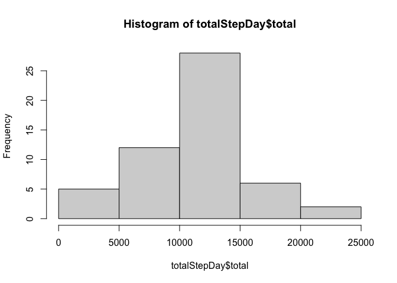
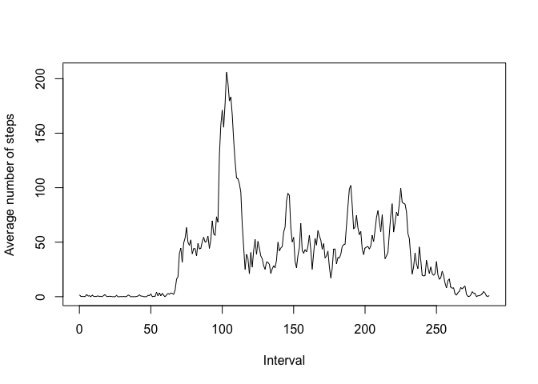
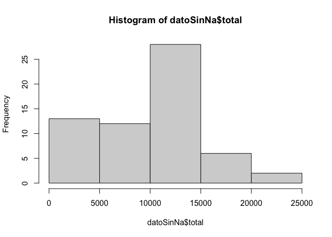
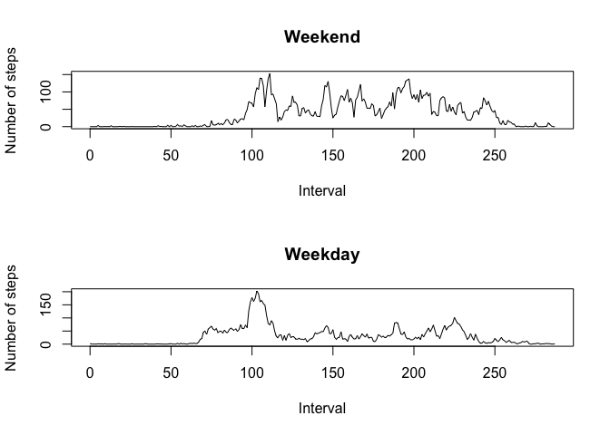

## Loading and preprocessing the data

El archivo con la data esta en el directorio raiz, en formato .zip

Se formatea la columna "date" al formato "as.Date"


```r
unzip(zipfile = "activity.zip", exdir = "./")
dato <- read.csv("./activity.csv")
dato$date <-  as.Date(dato$date)
```


## What is mean total number of steps taken per day?

Se agrupa la información por fecha y se totaliza por pasos.


```r
library(dplyr)
```

```
## 
## Attaching package: 'dplyr'
```

```
## The following objects are masked from 'package:stats':
## 
##     filter, lag
```

```
## The following objects are masked from 'package:base':
## 
##     intersect, setdiff, setequal, union
```

```r
totalStepDay <- group_by(dato, date) %>% summarise(total = sum(steps))
```

```
## `summarise()` ungrouping output (override with `.groups` argument)
```

```r
hist(totalStepDay$total)
```

<!-- -->

```r
media <- mean(totalStepDay$total, na.rm = TRUE)
mediana <- median(totalStepDay$total, na.rm = TRUE)
```
Para el total de número de pasos realizados por día, la  media es: 1.0766189\times 10^{4}, y la mediana es: 10765.

## What is the average daily activity pattern?

Se agrupa la informacion por intervalo y se saca el promedio de cada intervalo.


```r
avgDay <- group_by(dato, interval) %>% summarise(mean = mean(steps, na.rm = TRUE))
```

```
## `summarise()` ungrouping output (override with `.groups` argument)
```

```r
avgTs <- ts(data = avgDay$mean, start = 0)
maxStep <-  which.max(avgDay$mean)
plot.ts(avgTs, xlab = "Interval", ylab = "Average number of steps")
```

<!-- -->
El intervalo de 5 minutos con el máximo de numero de pasos es: 104.

## Imputing missing values

Se realiza el manejo de los valores NA.

La estrategia implementada para el manejo de NA se tuvo en cuenta que los Na estan por días completos,
por lo que realizar el promedio del mismo día daría otra vez Na, en consecuencia, se opto por definir 
esos valores Na en cero, para afectar solo el rango inicial de pasos totales por dia.


```r
sumNa <- sum(is.na(dato$steps))
datoSinNa <- dato %>% mutate(steps = replace(steps, which(is.na(steps)), 0))
datoSinNa <- group_by(datoSinNa, date) %>% summarise(total = sum(steps))
```

```
## `summarise()` ungrouping output (override with `.groups` argument)
```

```r
hist(datoSinNa$total)
```

<!-- -->

El número de NA en la información es: 2304.


```r
media2 <- mean(datoSinNa$total)
mediana2 <- median(datoSinNa$total)
```

Para el total de número de pasos realizados por día sin Na en los datos, la  media es: 9354.2295082, y la mediana es: 1.0395\times 10^{4}.

Se puede observar que los valores de la "media" y la "mediana" han cambiado, debido al cambio de valores NA
por 0. 

Por consiguiente el impacto en la medición de pasos por día se ve afectado al cambiar dichos valores. Es 
importante que concientemente se afecto solo un rango del histograma al definirlos en 0.

## Are there differences in activity patterns between weekdays and weekends?

Se trabaja con la información sin Na.

Se configura los datos sin Na con el factor "diaSemana".


```r
diaSemana <- c('Monday', 'Tuesday', 'Wednesday', 'Thursday', 'Friday')
datoSinNa2 <- dato %>% mutate(steps = replace(steps, which(is.na(steps)), 0))
datoSinNa2$dSem <- factor((weekdays(datoSinNa2$date) %in% diaSemana), levels=c(FALSE, TRUE), 
                          labels=c('weekend', 'weekday'))
avgDay2 <- group_by(datoSinNa2, dSem, interval) %>% summarise(mean = mean(steps, na.rm = TRUE))
```

```
## `summarise()` regrouping output by 'dSem' (override with `.groups` argument)
```

```r
weekendPlot <- avgDay2[1:288, ]
weekdayP <- avgDay2[289:576, ]
avgTs2 <- ts(data = weekendPlot$mean, start = 0)
avgTs3 <- ts(data = weekdayP$mean, start = 0)
par(mfrow=c(2, 1))
plot(avgTs2, xlab = "Interval", ylab = "Number of steps", main = "Weekend")
plot(avgTs3, xlab = "Interval", ylab = "Number of steps", main = "Weekday")
```

<!-- -->

